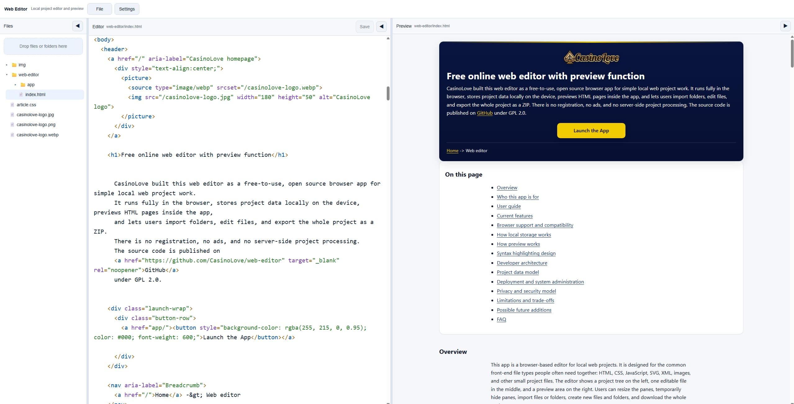

Web Editor
==========

A free, browser-based web editor and preview tool for local HTML, CSS, JavaScript, XML, SVG, images, and other project files.

It is designed for privacy-friendly local editing directly in the browser, with no server-side processing, no account, and no upload requirement. Projects are stored locally in the browser and can be exported as a ZIP archive.

Screenshot
----------

Live links
----------

* Live app: https://tech.casinolove.org/web-editor/app/
* Documentation: https://tech.casinolove.org/web-editor/

What this app does
------------------

Web Editor is a single-page browser app built for editing and previewing small to medium static web projects locally.

It splits the screen into three vertical areas:

* Files
* Editor
* Preview

The app is mainly designed for Chromium-based desktop browsers. It can still open in other browsers, but some capabilities may be limited depending on browser support.

Main features
-------------

* Browser-only local web project editor
* Three resizable panes for files, editor, and preview
* Local project storage inside the browser
* File tree with folders and expand/collapse support
* Create new files and folders
* Import files or whole folders from the local computer
* Drag and drop import
* ZIP export for the whole project
* One-file-at-a-time editing workflow with save protection
* Text editing for text-based files
* Image preview
* SVG preview and editing support
* HTML preview with linked local asset support
* JavaScript preview support for local projects
* Local fetch and XMLHttpRequest support in preview for project files
* Optional syntax highlighting for HTML, CSS, JS, and XML
* Dark and light theme support
* Editor font size selection
* Editor font family selection
* Empty new-project workflow
* Optional example project import
* Warning banner for non-desktop-Chromium environments

Supported project file types
----------------------------

The editor can store many file types. In practice, the app is aimed at common static web project files such as:

* HTML
* CSS
* JavaScript
* XML
* SVG
* TXT and similar text files
* Images such as JPG, PNG, WebP, GIF, and SVG
* Other binary assets that should remain in the project tree

Text files open in the editor.

Binary files do not open as text. Image files are shown in preview mode instead.

SVG is treated as a text file for editing and as an image/document for preview.

How local storage works
-----------------------

The app stores project files locally inside the browser. Nothing needs to be sent to a server.

This design is useful for:

* privacy-friendly editing
* fast local project iteration
* offline or limited-connectivity workflows
* simple deployment, because the app itself is just static files

Because storage is browser-local, projects are tied to the browser profile and origin where the app is running. Export important work regularly as ZIP files.

How preview works
-----------------

The preview is designed to behave much more like a small local static website environment than a plain HTML viewer.

That means it supports:

* linked CSS files
* linked JavaScript files
* local images
* SVG assets
* root-relative paths such as `/article.css`
* relative paths such as `images/photo.jpg`
* common runtime asset assignment from JavaScript
* local `fetch()` for project files
* local `XMLHttpRequest` for project files
* video poster paths
* track subtitle paths such as `.vtt`

This is especially useful for static sites that depend on linked assets and local data files.

The preview system is intentionally aimed at static-site style development, not at replacing a full development server.

Typical use cases
-----------------

* edit a small website directly in the browser
* preview HTML pages with local CSS and JS
* test static landing pages
* inspect and adjust exported static site files
* prepare simple HTML pages before deployment
* review project folders without installing a heavy desktop editor
* work on static documentation pages
* quickly test a website structure from imported files

Getting started
---------------

1. Open the app.
2. Create a new empty project, or import files or a folder.
3. Select a text file to open it in the editor.
4. Make changes.
5. Save the file.
6. Check the preview pane.
7. Export the project as ZIP when needed.

If you want a sample structure to explore the app first, use the example project option instead of New project.

User guide
----------

Creating a new project
----------------

Use the New project command to start with a completely empty local project.

This clears the current stored project for the app origin and starts fresh.

Adding files and folders
----------------

You can add content in several ways:

* create a new file
* create a new folder
* import individual files
* import a full folder structure
* drag and drop files or folders into the file area

Editing text files
----------------

When you open a text-based file, it appears in the editor pane.

The current workflow allows one opened file at a time. If you made changes, the app requires you to save or discard before switching to another file.

This was chosen to keep the first version simple and predictable.

Previewing files
----------------

Preview behavior depends on file type:

* HTML files render as web pages
* image files display as images
* SVG files render in preview and can also be edited as text
* unsupported binary files stay in the file tree but do not open as text

For images, the preview provides zoom controls.

Syntax highlighting
----------------

Syntax highlighting is optional and off by default.

Supported highlighted formats:

* HTML
* CSS
* JS
* XML

SVG benefits from XML-style highlighting.

This highlighting is intentionally lightweight. The goal is clarity, not full IDE-level parsing.

Settings
----------------

The settings menu currently includes:

* theme selection
* editor font size
* editor font family
* syntax highlighting on or off

The settings system is designed to be expanded later.

Browser support
---------------

Primary target:

* Chromium-based desktop browsers

The app may still work in other browsers, but support can vary because browser file and storage APIs are not implemented equally everywhere.

A warning is shown on open when the environment is not a desktop Chromium-style browser.

This warning can be dismissed.

Why the app is browser-only
---------------------------

This project was designed around a few practical goals:

* no backend required
* no uploads to remote servers
* simple deployment as static files
* privacy-friendly local use
* easy open source distribution

This makes the tool especially useful for quick editing, static site work, education, demos, and environments where server-side processing is unnecessary or undesirable.

Why the editor is intentionally simple
--------------------------------------

This is not trying to be a full replacement for a desktop IDE.

The current architecture focuses on:

* predictable behavior
* low complexity
* easy deployment
* easy modification by developers
* privacy-friendly local usage

Some features are intentionally limited in the first version so the code remains understandable and extendable.

Examples:

* one file open at a time
* lightweight syntax highlighting
* no external editor framework requirement
* no built-in package manager or bundler

Developer overview
------------------

The app is built as a static front-end project.

Typical structure:

* `index.html`
* `web-editor.css`
* `web-editor.js`

General architecture
----------------

The codebase is centered around a few main responsibilities:

* local project state and storage
* file tree rendering and interaction
* editor state
* preview generation and asset resolution
* import and export logic
* settings persistence and UI updates

The design is intentionally modular enough to expand later with features such as:

* multiple editor tabs
* richer syntax highlighting
* rename and move operations
* search
* replace
* more preview modes
* additional file-type behaviors

Preview design details
----------------

The preview layer is the most custom part of the project.

It does more than simply inject HTML into an iframe. It also resolves local project assets so imported websites behave more like they would on a static host.

This includes rewriting and intercepting project-local references so assets can be loaded from browser-local project storage.

This is why the preview can support cases such as:

* linked stylesheets
* image references in HTML
* JavaScript that fetches local data files
* video poster files
* subtitle track files
* runtime-assigned asset URLs

Why the preview uses a sandboxed iframe
----------------

The preview uses an iframe with permissions that allow local scripts to run and local project assets to be resolved.

In Chromium developer tools you may see a warning saying that an iframe with both script permission and same-origin style behavior can escape its sandbox.

For this app, that warning is expected because the preview needs enough capability to run local project code realistically.

In practical terms, previewed code should be treated as trusted local project code.

That is a design choice, not an accidental side effect.

Syntax highlighting design
----------------

The syntax highlighting is intentionally lightweight.

It is meant to improve readability without turning the editor into a full IDE. The current implementation supports a defined set of text formats and can be turned off entirely.

This keeps the app simpler and avoids forcing highlighting behavior on users who prefer a plain editor.

Why no external code editor dependency
----------------

The project is intentionally lightweight and self-contained.

Avoiding heavy external editor frameworks keeps:

* the code easier to audit
* deployment simpler
* licensing clearer
* customization easier for small teams
* the initial load smaller

Developers who want more advanced editing features can build on top of the current structure.

Suggested future developer improvements
---------------------------------------

Possible next steps include:

* multiple open tabs
* rename and move support
* delete confirmation improvements
* search inside files
* project-wide search
* line numbers
* undo and redo improvements
* keyboard shortcuts
* richer syntax highlighting
* HTML formatting helpers
* CSS and JS formatting helpers
* file type icons
* image metadata view
* drag reordering in tree where appropriate
* local preferences export/import

Deployment guide
----------------

This app is a static website.

That means deployment is simple:

1. Place the files on any normal static web host.
2. Serve them over HTTP or HTTPS.
3. Open the app in a supported browser.

No database is required.
No server-side runtime is required.
No API service is required.

Typical hosting options
----------------

* NGINX static site
* Apache static site
* GitHub Pages, if your environment and browser storage expectations fit your use case
* any static file hosting platform
* local LAN static hosting

Local testing
----------------

For local testing, a basic static HTTP server is usually enough.

Examples include:

* Python simple HTTP server
* NGINX on a local machine
* Apache on a local machine

Serving over HTTP rather than opening the file directly from disk is recommended for more consistent browser behavior.

System administrator notes
----------------

From an infrastructure perspective, this app is low-maintenance.

Important points:

* it is a front-end only app
* there is no server-side file processing
* user project data remains in the browser
* exported ZIP files are created client-side
* browser storage persistence depends on browser policies and user actions

Practical admin considerations:

* keep normal static asset caching sensible
* do not assume browser local storage is a backup system
* tell users to export ZIP backups for important projects
* test in target Chromium-based desktop browsers
* if hosting under a strict CSP, validate that the preview approach still works with your policy

Privacy and security model
--------------------------

This tool is privacy-friendly by design because project files remain local to the browser unless the user explicitly exports them.

However, there is an important distinction:

* local project storage is private to the browser environment
* previewed HTML and JavaScript are still executed in the preview context

So the preview should be treated as executing trusted local project code.

This is appropriate for a local web editor, but it is not meant to safely execute untrusted hostile code.

Limitations
-----------

This app is intentionally focused on static web editing and preview.

Current limitations include:

* primarily optimized for Chromium-based desktop browsers
* one open file at a time
* no full IDE feature set
* syntax highlighting is lightweight, not parser-complete
* preview is not a full replacement for a development server
* advanced module-loading workflows may still need a real server environment
* service worker workflows are outside the intended scope
* browser-local storage should not be treated as permanent backup

This is a deliberate tradeoff in favor of simplicity, privacy, and deployability.

Why GPL v2.0
------------

This project is released under GPL v2.0.

That makes it suitable for open source distribution while keeping the licensing terms clear for reuse, modification, and redistribution.

Please review the LICENSE file in the repository for the full license text.

Repository contents
-------------------

You can expect the repository to include the core static app files and project documentation.

Typical published files:

* `index.html`
* `web-editor.css`
* `web-editor.js`
* `README.md`
* `LICENSE`
* `screenshot.jpg`

How to contribute
-----------------

Contributions that keep the project lightweight, understandable, and privacy-friendly are especially valuable.

Good contribution areas include:

* bug fixes
* browser compatibility improvements
* UI polish
* editor usability improvements
* preview compatibility improvements
* documentation improvements
* accessibility improvements

Before making major structural changes, it is useful to preserve the core purpose of the app:

* browser-only
* no server-side processing
* local-first workflow
* simple deployment

Credits
-------

Created by Casinolove Kft.

Project links:

* GitHub: https://github.com/CasinoLove/web-editor
* Documentation: https://tech.casinolove.org/web-editor/
* Live app: https://tech.casinolove.org/web-editor/app/

License
-------

GPL v2.0. See the `LICENSE` file for details.
